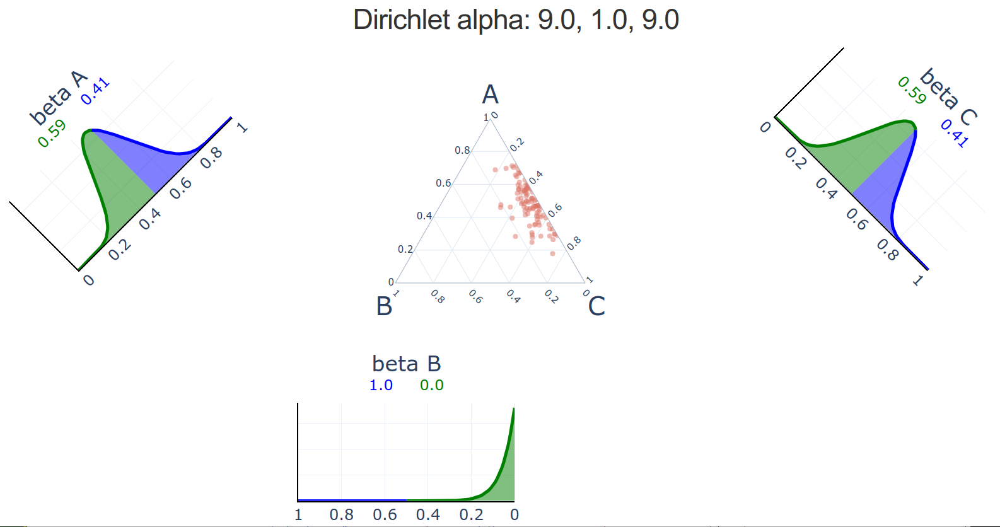
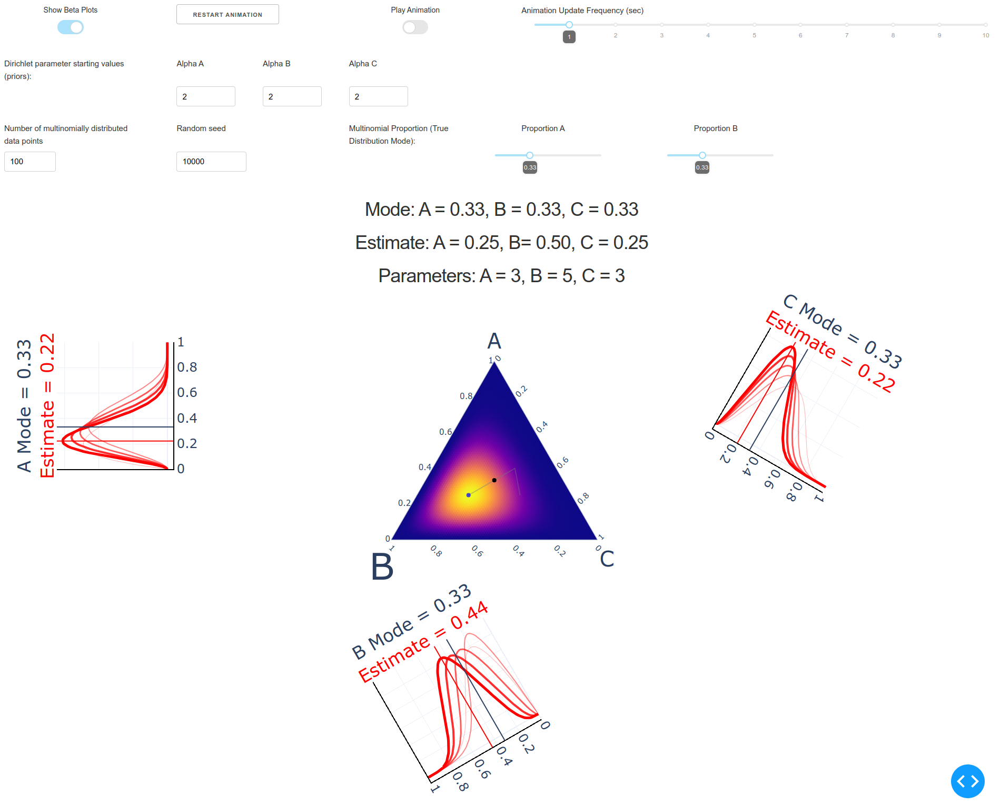
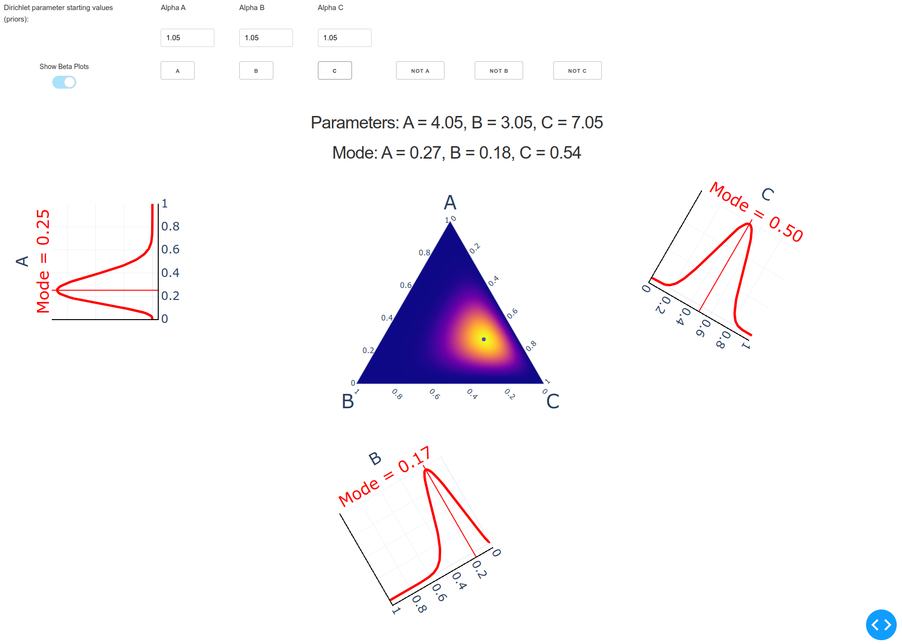
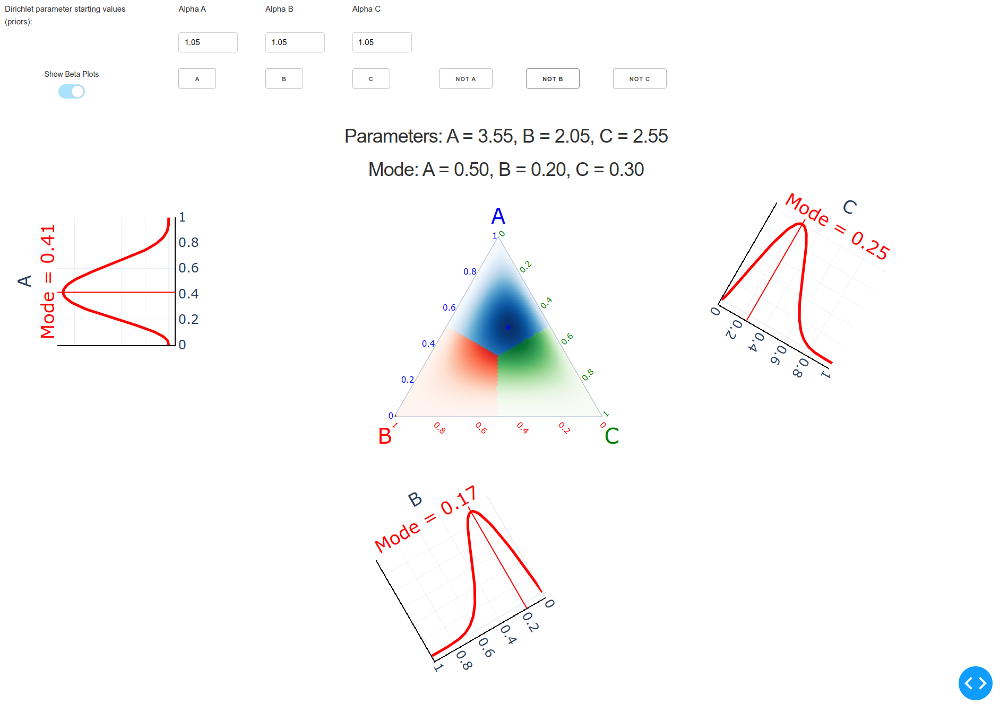

# Dirichlet-Multinomial Distribution Visualization:  Plotly Dash Application

The modules in this repository run 4 [Plotly Dash](https://dash.plotly.com/) apps that display and animate 3-dimensional [Dirichlet-multinomial distributions](https://en.wikipedia.org/wiki/Dirichlet-multinomial_distribution).

## Dirichlet-Multinomial App #1

The first app (in the directory ```dirichlet_dash_app_01```) statically displays a random sample from a [Dirichlet distribution](https://en.wikipedia.org/wiki/Dirichlet_distribution) with alpha parameters read from external files.  The 3-dimensional Dirichlet distribution sample is displayed in the center (the coordinate space forms an equilateral triangle) and the alpha parameter values are shown above in the title.  The 3 marginal [beta distributions](https://en.wikipedia.org/wiki/Beta_distribution) are displayed near and roughly rotated to correspond with their respective axes on the triangular Dirichlet distribution plot.  The beta plots are divided into green and blue at a threshold of 0.50, and the proportions of each distribution that lie below or above the threshold, respectively, are shown above each beta plot.

Note that [gridlines for the barycentric coordinates](https://en.wikipedia.org/wiki/Ternary_plot) are visible in the triangular/ternary plot for the Dirichlet distribution.



## Dirichlet-Multinomial App #2

The second app (in the directory ```dirichlet_dash_app_02```) animates changes in the density of the Dirichlet distribution (and of its marginal beta distributions) starting with a chosen set of alpha parameters and proceeding with random draws from a multinomial distribution with chosen parameters.  

The density of the Dirichlet distribution is shown as a color gradient ranging from dark blue to yellow, where yellow denotes the highest densities.  The true mode of the Dirichlet density is marked as a black dot, while the current estimate of the mode is marked as a lighter dot and previous estimates are connected by a light gray path of line segments.  The true mode and its current estimate are also labeled above the Dirichlet distribution plot as *Mode* and *Estimate*, respectively.  The current Dirichlet distribution parameters are labeled as *Parameters*.

Each of the 3 marginal beta distribution plots similarly shows its true mode marked as a dark line on the plot and labeled as *Mode*.  The current estimate of the mode is shown as a red line and marked as *Estimate*.  The current marginal beta distribution is shown as the thickest red curve, while previous beta distributions are shown as successively thinner red curves.

Application controls:

- Show Beta Plots - toggles display of marginal beta plots on or off
- Restart Animation - reset the animation to its first state, when only the starting prior Dirichlet distribution is displayed
- Play Animation - toggles the animation on or off; *off* pauses the animation at its current state
- Animation Update Frequency (sec) - the animation updates once every X seconds, where X is chosen here
- Dirichlet parameter alpha starting values (priors):  Alpha A - the starting value for the Dirichlet parameter alpha A; accepts value with up to 2 decimal places
- Dirichlet parameter alpha starting values (priors):  Alpha B - the starting value for the Dirichlet parameter alpha B; accepts value with up to 2 decimal places
- Dirichlet parameter alpha starting values (priors):  Alpha C - the starting value for the Dirichlet parameter alpha C; accepts value with up to 2 decimal places
- Number of multinomially distributed data points - how long the sequence of multinomial data is, i.e., the number of updates
- Random seed - [pseudo-random seed](https://en.wikipedia.org/wiki/Pseudorandom_number_generator) that allows reproducible results whenever the same seed is chosen
- Multinomial Proportion (True Multinomial Distribution Mode):  Proportion A - the proportion of Category A used to generate the [multinomially distributed data](https://en.wikipedia.org/wiki/Multinomial_distribution)
- Multinomial Proportion (True Multinomial Distribution Mode):  Proportion B - the proportion of Category B used to generate the [multinomially distributed data](https://en.wikipedia.org/wiki/Multinomial_distribution)



## Dirichlet-Multinomial App #3

The third app (in the directory ```dirichlet_dash_app_03```) has many of the same features as App #2 described above.  The major difference is that the updates of multinomial data can be manually entered one-by-one, instead of relying on an automatically generated random sample of multinomial data.  This feature lets the user choose different update scenarios to explore how the Dirichlet distribution changes in response.  Unlike in App #2, only the current mode estimates and beta distributions are shown; the previous estimates are omitted.

In addition to choosing an update from any of the 3 categories (A, B, or C), a user can also choose an update that negates one of the categories (labeled as *Not A*, *Not B*, and *Not C*).  Mathematically, this means that the update is divided evenly and applied to the remaining categories.  That is, if a user chooses to update the distributions with a single observation of A, then 1 is added to the Dirichlet distribution parameter alpha for category A.  If a user chooses to update the distributions with a single observation of Not-A, then one half is added to each of the alphas for categories B and C.  

Application controls:

- Dirichlet parameter alpha starting values (priors):  Alpha A - the starting value for the Dirichlet parameter alpha A; accepts value with up to 2 decimal places
- Dirichlet parameter alpha starting values (priors):  Alpha B - the starting value for the Dirichlet parameter alpha B; accepts value with up to 2 decimal places
- Dirichlet parameter alpha starting values (priors):  Alpha C - the starting value for the Dirichlet parameter alpha C; accepts value with up to 2 decimal places
- Show Beta Plots - toggles display of marginal beta plots on or off
- A - update the Dirichlet and marginal beta distributions with a single observation from Category A
- B - update the Dirichlet and marginal beta distributions with a single observation from Category B
- C - update the Dirichlet and marginal beta distributions with a single observation from Category C
- Not A - update the Dirichlet and marginal beta distributions with a single observation that negates Category A
- Not B - update the Dirichlet and marginal beta distributions with a single observation that negates Category B
- Not C - update the Dirichlet and marginal beta distributions with a single observation that negates Category C



## Dirichlet-Multinomial App #4

The fourth app (in the directory ```dirichlet_dash_app_04```) is nearly identical to App #3 described above.  The only difference is that the triangular/ternary coordinate space of the 3-dimensional Dirichlet distribution has been evenly divided into thirds and color-coded accordingly.  Each color thus represents the category with the highest proportion of all the categories at that coordinate.  For example, the coordinate where A = 0.50, B = 0.20, and C = 0.30 is colored blue, which is category A's color, because category A has the highest proportion at that coordinate (i.e., 0.50 > 0.20 and 0.50 > 0.30).



## Run with Docker

In each app's directory, where the ```Dockerfile``` is located (i.e., ```dirichlet_dash_app_01```, ```dirichlet_dash_app_02```, and so on), you can [run these commands](https://docs.docker.com/get-started/):

```code
sudo docker build -t docker-app .

sudo docker run -p 8050:8050 docker-app 
```

In the commands above, you may substitute a name of your own choosing for ```docker-app```.

Then point your web browser at:

http://127.0.0.1:8050/

OR

http://0.0.0.0:8050/


## Run with Poetry

In the *src* directory for each app, you can [run these commands](https://python-poetry.org/docs/basic-usage/):

```code
poetry install

poetry shell

python dirichlet_multinomial.py
```

Then point your web browser at:

http://127.0.0.1:8050/

OR

http://0.0.0.0:8050/


## Run with Anaconda

In the *src* directory for each app, you can [run these commands](https://docs.conda.io/projects/conda/en/latest/user-guide/tasks/manage-environments.html):

```code
conda env create -f environment.yml

conda activate web_dashboard

python dirichlet_multinomial.py
```

Then point your web browser at:

http://127.0.0.1:8050/

OR

http://0.0.0.0:8050/


